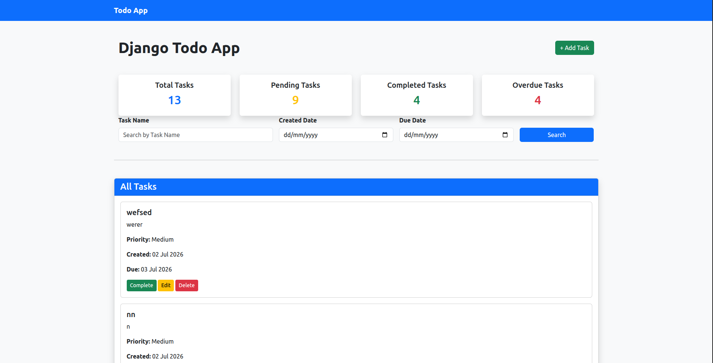
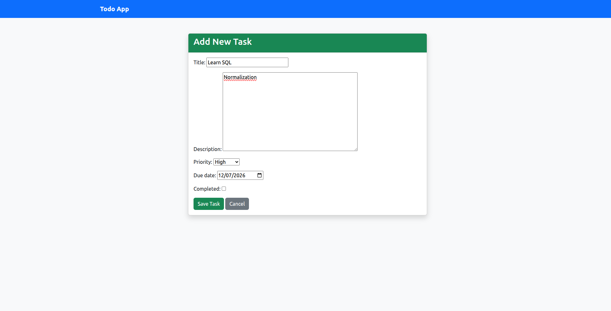
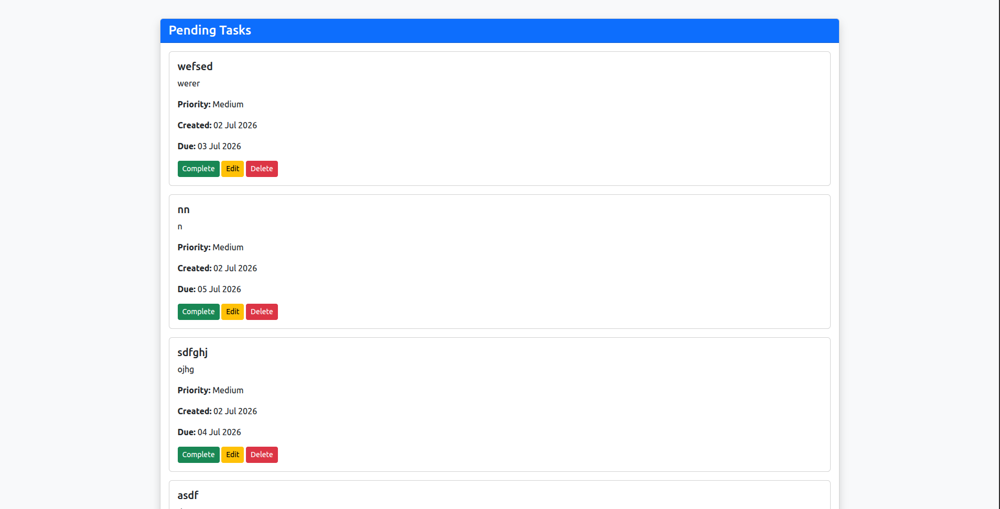

# Django Todo App

A simple and user-friendly Todo List web application built using **Django**. This application helps users create, manage, edit, search, and organize their daily tasks efficiently.

---

## Features

- Add New Task
- Edit Existing Task
- Delete Task
- Mark Task as Completed
- Undo Completed Task
- Dashboard with Task Statistics
  - Total Tasks
  - Pending Tasks
  - Completed Tasks
  - Overdue Tasks
- Filter Tasks using Dashboard Cards
- Search Tasks
  - Search by Task Name
  - Search by Created Date
  - Search by Due Date
- Task Priority
  - High
  - Medium
  - Low
- Due Date Validation
- Duplicate Pending Task Validation
- Responsive Bootstrap UI

---

## Technologies Used

- Python
- Django
- SQLite
- HTML5
- CSS3
- Bootstrap 5

---

## Project Structure

```
todo_project/
│
├── todo/
│   ├── migrations/
│   ├── templates/
│   │   └── todo/
│   ├── static/
│   ├── models.py
│   ├── forms.py
│   ├── views.py
│   ├── urls.py
│   └── admin.py
│
├── todo_project/
│   ├── settings.py
│   ├── urls.py
│   └── wsgi.py
│
├── db.sqlite3
├── manage.py
└── README.md
```

---

## Screenshots

## Home Page


## Add Task


## Pending Task



## Installation

### Clone Repository

```bash
git clone https://github.com/ajinkya2201/Django-ToDo-Application
```

### Move into Project Folder

```bash
cd django-todo-app
```

### Create Virtual Environment

```bash
python -m venv venv
```

### Activate Virtual Environment

#### Windows

```bash
venv\Scripts\activate
```

#### Linux / macOS

```bash
source venv/bin/activate
```

### Install Dependencies

```bash
pip install -r requirements.txt
```

### Apply Migrations

```bash
python manage.py migrate
```

### Run Server

```bash
python manage.py runserver
```

Open:

```
http://127.0.0.1:8000/
```

---

## Dashboard

The home page displays:

- Total Tasks
- Pending Tasks
- Completed Tasks
- Overdue Tasks

Clicking on any dashboard card filters and displays the corresponding tasks on the same page without navigating to another page.

---

## Task Management

Users can:

- Add Task
- Edit Task
- Delete Task
- Complete Task
- Undo Completed Task

---

## Search Functionality

The application provides multiple search options:

- Search by Task Name
- Search by Created Date
- Search by Due Date

Search works together with task filters.

---

## Task Priority

Each task can have one of the following priorities:

- High
- Medium
- Low

Priority helps users identify important tasks.

---

## Validations

The application includes the following validations:

- Due date cannot be in the past.
- Duplicate pending tasks are not allowed.
- Empty search displays all tasks.
- Search returns a message when no matching task is found.

---

## Database

The project uses SQLite as the database.

### Task Model

| Field | Type |
|--------|------|
| Title | CharField |
| Description | TextField |
| Priority | CharField |
| Due Date | DateField |
| Completed | BooleanField |
| Created At | DateTimeField |
| Updated At | DateTimeField |

---

## Future Enhancements

- User Authentication
- Email Notifications
- Task Categories
- File Attachments
- Dark Mode
- Task Sorting
- Export Tasks (PDF/Excel)
- REST API Integration

---

## Learning Outcomes

This project demonstrates:

- Django Models
- Django Views
- Django Templates
- URL Routing
- Django ORM
- CRUD Operations
- Form Validation
- Query Filtering
- Search Functionality
- Bootstrap Integration

---

## Author

**Ajinkya Shinde**
M.Sc. Computer Science  
Savitribai Phule Pune University

